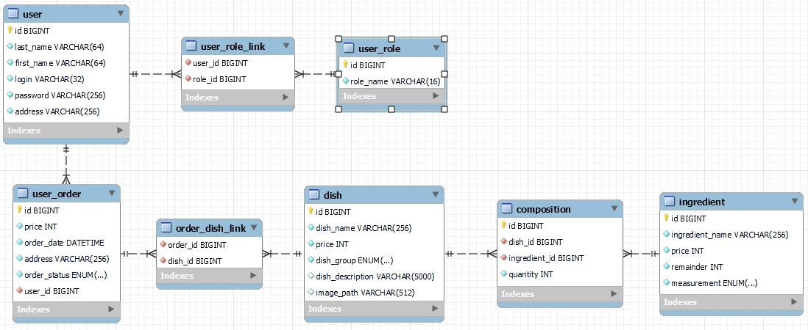

<h1>Restaurant</h1>

_developed by Kolyago V. under the direction of Bobrovich M._

<h2>Application description</h2>

A web application **Restaurant** was created for educational purposes to study modern Java frameworks. 

The following frameworks are used in this project:
- **Stream API** 
- **Lombok**
- **Maven**
- **Flyway**
- **JDBC**
- **Hibernate**
- **Spring**
    - **Core**
    - **Boot**
    - **Data**
    - **Security**

Two databases are also used in this project:
- **MySQL** database for the main application
- **H2** for testing

<h2>Main function</h2>
The main function of the application is **to form a menu of dishes that can be ordered by the client**.  
When you **select a dish** from the menu, you **create an order** that belongs to the user.   
One order can contain several dishes, so each dish can be added to several orders.  
Each dish consists of ingredients contained in a different volume, one ingredient can be part of several dishes.  
Roles are used to delineate the functionality of the application. The user can have multiple roles and the role can have multiple users.  

The structure of the database is presented below:

The entire functionality of the application is represented in the form of a **user request to the server** and **a response**, **which is formed on 
the basis of requested parameters**. The list of possible requests to the server is provided below

query | unauthorised | user | admin
---| :---: | :---: | :---:
_findAllRoles_ | - | - | +
_findByIdUser_ | - | + | +
_findAllUsers_ | + | + | +
_addUser_ | + | + | +
_updateUser_ | - | + | +
_deleteUser_ | - | + | +
_deleteRoleFromUser_ | + | + | +
_addRoleToUser_ | + | + | +
_getOrderById_ | - | + | +
_getOrders_ | - | + | +
_addOrder_ | - | + | +
_updateOrder_ | - | + | +
_deleteOrder_ | - | + | +
_getDishIngredients_ | - | + | +
_addDishToOrder_ | - | + | +
_deleteDishFromOrder_ | - | + | +
_getIngredientById_ | - | - | +
_getIngredients_ | - | - | +
_addIngredient_ | - | - | +
_updateIngredient_ | - | - | +
_deleteIngredient_ | - | - | +
_getDishById_ | + | + | +
_getDishes_ | + | + | +
_addDish_ | - | - | +
_updateDish_ | - | - | +
_deleteDish_ | - | - | +
_getDishIngredients_ | + | + | +
_addIngredientToDish_ | - | - | +
_deleteIngredientFromDish_ | - | - | +